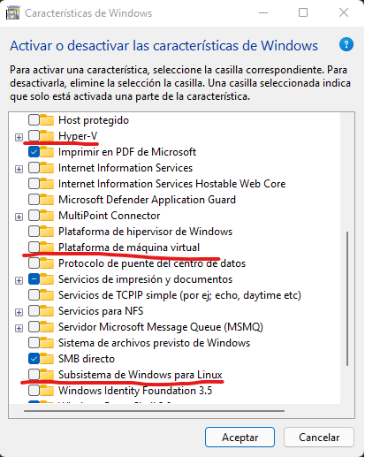
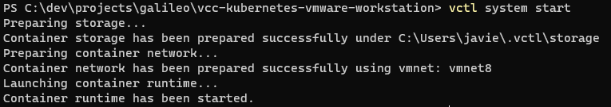
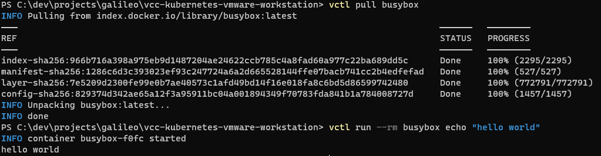
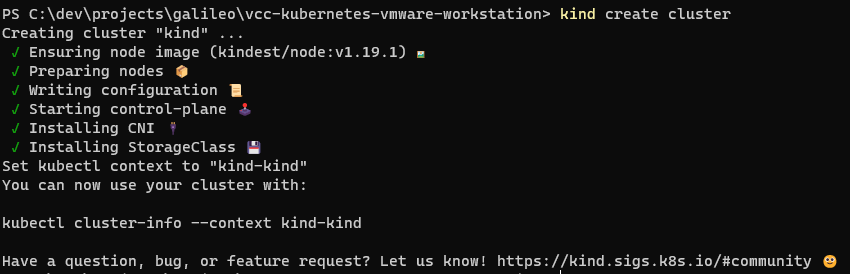
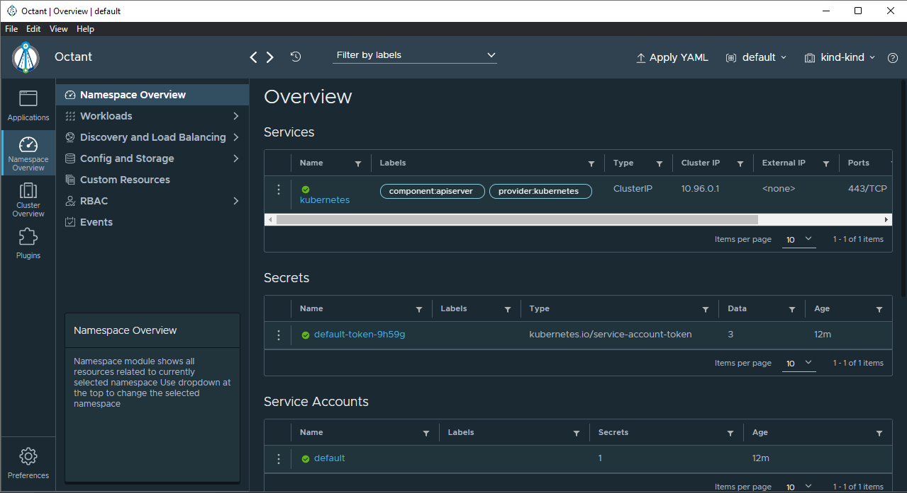

# Cluster de Kubernetes con VMware Workstation 16 Pro

En este laboratorio, se utilizará las características de contenedores que vienen con VMware Workstation para iniciar un entorno de trabajo de Kubernetes de forma sencilla. Para efectos de las instrucciones se asume una máquina anfitriona Windows.

## Prerequisitos

* Windows 10 1809 o posterior
* [WMware Workstation Pro 16.2.2+](https://www.vmware.com/latam/products/workstation-pro/workstation-pro-evaluation.html)
* [Visual Studio Code](https://code.visualstudio.com/) o el editor de tu preferencia con soporte para archivos YAML
* Una máquina con bastante capacidad:
  - procesador i5 o superior
  - 16 GB de RAM
  - 10 GB de almacenamiento disponibles

## Antes de empezar

A pesar de que las nuevas versiones de VMware pueden trabajar en Windows con Hyper-v habilitado, esto puede causar inestabilidad general en el sistema, por lo que si tiene WSL2 habilitado, las características de virtualización y/o Hyper-V recomiendo desactivarlas antes de instalar o iniciar VMware.



## Iniciando el Clúster

VMware viene con la herramienta de comando [`vctl`]('https://docs.vmware.com/en/VMware-Workstation-Pro/16.0/com.vmware.ws.using.doc/GUID-78E7339F-7294-4F3E-9AD0-1E14C201FA40.html') la cual permite manejar contenedores en un equipo anfitrión utilizando la tecnología de virtualización de VMware ESXi utilizando una imagen de máquina virtual especial orientada a contenedores que corre un runtime llamado [CRX](https://blogs.vmware.com/vsphere/2020/05/vsphere-7-vsphere-pods-explained.html). Con base en esta tecnología, `vctl` soporta la creación de clústers de Kubernetes utilizando [Kind](https://kind.sigs.k8s.io/). La información de VMware no es extensa pero describe como se utiliza la [línea de comandos de `vctl` y `kind`](https://docs.vmware.com/en/VMware-Workstation-Pro/16.0/com.vmware.ws.using.doc/GUID-1CA929BB-93A9-4F1C-A3A8-7A3A171FAC35.html).

Para iniciar un cluster primero se inicializa el servicio de contenedores. Esto se puede realizar ejecutando en la terminal de Windows:

```powershell
vctl system start
```

El resultado debe mostrarse similar a este:



Al correr este comando, se creará la carpeta `%USERPROFILE%/.vctl` donde se almacenarán archivos de cache que corresponden al runtime de contenedores y herramientas de líneas de comando. Para corroborar que funciona nosotros podemos probar descargar una imagen y correr un contenedor:

```powershell
vctl pull busybox
vctl run --rm busybox echo "hello world"
```
El resultado de estos comandos debe lucir de esta manera:

![]

Una vez que corroboramos que nuestro entorno de contenedores funciona adecuadamente, podemos crear un cluster de kind. Primero, se debe ejecutar

```powershell
vctl kind
```

Esto abrirá una nueva consola con el comando kind habilitado. En esta nueva consola, para iniciar un cluster de 1 nodo procedemos a correr:

```powershell
kind create cluster
```

Esto debe crear las configuraciones y máquinas virtuales necesarias para el clúster. El resultado de ejecutar este comando luce similar a:


A partir de ahora tenemos un cluster corriendo en nuestra máquina 🙌🙌🙌

## Visualizando nuestro Cluster

Para ver el estado de nuestro clúster, utilizaremos una herramienta open source creada por el equipo de VMware llamada [Octant](https://octant.dev/). En el mundo de kubernetes la herramienta por defecto para hacer esto suele ser [kube-dashboard](https://kubernetes.io/docs/tasks/access-application-cluster/web-ui-dashboard/) pero aprovecharemos a explorar la primera herramienta mencionada ya que es parte del ecosistema de Kubernetes de VMWare [vSphere Tanzu](https://www.vmware.com/latam/products/vsphere/vsphere-with-tanzu.html).

Al visitar la [página de descargas de Octant](https://github.com/vmware-tanzu/octant/releases/tag/v0.25.1), descargaremos para este laboratorio el instalador [Octant.Setup.0.25.1.exe](https://github.com/vmware-tanzu/octant/releases/download/v0.25.1/Octant.Setup.0.25.1.exe). Una vez instalado, Octant utilizará los contextos configurados en nuestro folder de .kube/config (habilitado previamente por el comando de kind).



Si nos vamos a la sección de `Cluster Overview > Nodes` podremos ver que nuestro clúster está estructurado por un único nodo en ejecución.


## Ejecutando un Pod

En este momento tenemos 2 maneras de subir cargas de trabajo a nuestro cluster. Una es utilizando la línea de comandos con `kubectl` y la otra es usar la interfaz de `Octant` para aplicar un YAML. En el caso de la línea de comando, para el ejemplo usaremos una imagen de `whoami` para probar una carga de trabajo en el clúster:

```powershell
# Dentro del folder del laboratorio
kubectl apply -f resources/pod.yml
```