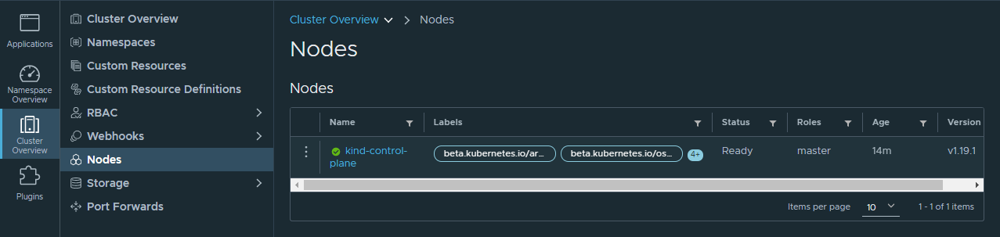

# Cluster de Kubernetes con VMware Workstation 16 Pro

En este laboratorio, se utilizará las características de contenedores que vienen con VMware Workstation para iniciar un entorno de trabajo de Kubernetes de forma sencilla. Para efectos de las instrucciones se asume una máquina anfitriona Windows.

## Prerequisitos

* Windows 10 1809 o posterior
* [WMware Workstation Pro 16.2.2+](https://www.vmware.com/latam/products/workstation-pro/workstation-pro-evaluation.html)
* [Visual Studio Code](https://code.visualstudio.com/) o el editor de tu preferencia con soporte para archivos YAML
* Una máquina con bastante capacidad:
  - procesador i5 o superior
  - 16 GB de RAM
  - 10 GB de almacenamiento disponibles

## Antes de empezar

A pesar de que las nuevas versiones de VMware pueden trabajar en Windows con Hyper-v habilitado, esto puede causar inestabilidad general en el sistema, por lo que si tiene WSL2 habilitado, las características de virtualización y/o Hyper-V recomiendo desactivarlas antes de instalar o iniciar VMware.


## Iniciando el Clúster

VMware viene con la herramienta de comando [`vctl`]('https://docs.vmware.com/en/VMware-Workstation-Pro/16.0/com.vmware.ws.using.doc/GUID-78E7339F-7294-4F3E-9AD0-1E14C201FA40.html') la cual permite manejar contenedores en un equipo anfitrión utilizando la tecnología de virtualización de VMware ESXi utilizando una imagen de máquina virtual especial orientada a contenedores que corre un runtime llamado [CRX](https://blogs.vmware.com/vsphere/2020/05/vsphere-7-vsphere-pods-explained.html). Con base en esta tecnología, `vctl` soporta la creación de clústers de Kubernetes utilizando [Kind](https://kind.sigs.k8s.io/). La información de VMware no es extensa pero describe como se utiliza la [línea de comandos de `vctl` y `kind`](https://docs.vmware.com/en/VMware-Workstation-Pro/16.0/com.vmware.ws.using.doc/GUID-1CA929BB-93A9-4F1C-A3A8-7A3A171FAC35.html).

Para iniciar un cluster primero se inicializa el servicio de contenedores. Esto se puede realizar ejecutando en la terminal de Windows:

```powershell
vctl system start
```

El resultado debe mostrarse similar a este:


Al correr este comando, se creará la carpeta `%USERPROFILE%/.vctl` donde se almacenarán archivos de cache que corresponden al runtime de contenedores y herramientas de líneas de comando. Para corroborar que funciona nosotros podemos probar descargar una imagen y correr un contenedor:

```powershell
vctl pull busybox
vctl run --rm busybox echo "hello world"
```
El resultado de estos comandos debe lucir de esta manera:

![]

Una vez que corroboramos que nuestro entorno de contenedores funciona adecuadamente, podemos crear un cluster de kind. Primero, se debe ejecutar

```powershell
vctl kind
```

Esto abrirá una nueva consola con el comando kind habilitado. En esta nueva consola, para iniciar un cluster de 1 nodo procedemos a correr:

```powershell
kind create cluster
```

Esto debe crear las configuraciones y máquinas virtuales necesarias para el clúster. El resultado de ejecutar este comando luce similar a:


A partir de ahora tenemos un cluster corriendo en nuestra máquina 🙌🙌🙌

## Visualizando nuestro Cluster

Para ver el estado de nuestro clúster, utilizaremos una herramienta open source creada por el equipo de VMware llamada [Octant](https://octant.dev/). En el mundo de kubernetes la herramienta por defecto para hacer esto suele ser [kube-dashboard](https://kubernetes.io/docs/tasks/access-application-cluster/web-ui-dashboard/) pero aprovecharemos a explorar la primera herramienta mencionada ya que es parte del ecosistema de Kubernetes de VMWare [vSphere Tanzu](https://www.vmware.com/latam/products/vsphere/vsphere-with-tanzu.html).

Al visitar la [página de descargas de Octant](https://github.com/vmware-tanzu/octant/releases/tag/v0.25.1), descargaremos para este laboratorio el instalador [Octant.Setup.0.25.1.exe](https://github.com/vmware-tanzu/octant/releases/download/v0.25.1/Octant.Setup.0.25.1.exe). Una vez instalado, Octant utilizará los contextos configurados en nuestro folder de .kube/config (habilitado previamente por el comando de kind).


Si nos vamos a la sección de `Cluster Overview > Nodes` podremos ver que nuestro clúster está estructurado por un único nodo en ejecución.



## Ejecutando un Pod

En este momento tenemos 2 maneras de subir cargas de trabajo a nuestro cluster. Una es utilizando la línea de comandos con `kubectl` y la otra es usar la interfaz de `Octant` para aplicar un YAML. En el caso de la línea de comando, para el ejemplo usaremos una imagen de `whoami` para probar una carga de trabajo en el clúster:

```powershell
# Dentro del folder del laboratorio
kubectl apply -f resources/pod.yml

# debe mostrar pod/whoami created
```

Una vez creado el Pod, podremos ver en Octant en la sección de `Applications` que hay una nueva aplicación corriendo llamada `whoami`. Si nosotros abrimos la carga de trabajo nos saldrá un mapa de los recursos que utiliza, en esta veremos el pod que acabamos de crear con la definción que subimos previamente. Al darle doble click al pod podremos irnos directo a la sección `Namespace Overview > Workloads > Pods > whoami`. De esta forma podremos ver los detalles de nuestro pod, como la IP interna dentro del cluster, el estado de nuestro pod, entre otras cosas. 


Una de las funcionalidades interesantes de Octant es que permite fácilmente hacer port forwarding lo que permite exponer el puerto del contenedor dentro de nuestro pod en nuestra máquina para que podamos fácilmente acceder al mismo. Al presionar el botón "Start port Forwarding" nos mostrará una URL en la que podremos ver a nuestro pod en acción. En nuestro caso, es informacion sobre el contenedor y la petición que realizamos:


## Limpiando nuestro entorno

Luego de ejecutar nuestro cluster, cuando demos por concluído nuestro trabajo, podemos eliminar el clúster de Kind utilizando el comando:

```
# eliminamos el clúster
kind delete cluster
# detenemos el servicio de contenedores
vctl system stop
```

# Laboratorio

Para cada paso deberás documentar con capturas de pantalla que incluyan uun editor de texto con tu número de carné, la fecha y deberás colocarlas en la carpeta `screenshots` con el nombre `paso-<número de paso>.png`. Junto a esto deberás enviar los archivos de este laboratorio modificados según requieran las instrucciones indicadas más adelante. Recuerda que para poder usar los comandos de `kind` y `kubectl` debes primero invocar el comando `vctl kind`

1. Inicia un nuevo clúster, esta vez utilizando el archivo de configuración provisto en el laboratorio con `kind create cluster --config cluster.yaml`. Utilizando Octant, dirigete a `Cluster Overview > Nodes` y revisa que esté corriendo el plano de control y dos nodos de trabajo.
1. Carga al cluster el deployment de nginx con `kubectl apply -f resources/deployment.yml`. En Octant, dirígete a la sección de `Namespace Overview > Deployments > Nginx` y asegurate de que se encuentren dos pods de nginx ejecutandose.
1. Investiga como crear un recurso de tipo servicio. Crea un servicio de tipo ClusterIP que esté asociado a los pods del deploment del paso anterior. Utiliza Octant para asegurarte de que el servicio se haya creado exitosamente.
1. En Octant, ve a `Namespace Overview > Discovery and Load Balancing > Services > Nginx` y habilita el port forwarding para asegurarte que el servicio que creaste apunta correctamente a los pods del deployment. Al visitar la url del puerto forwardeado deberás poder ver la página de bienvenida de NGINX.
1. El proyecto cuenta con dos config maps: `homepage-configMap.yml` y `nginx-configMap.yml`, carga estas definiciones al cluster. Apoyate en la documentación de Kubernetes para [configurar un Pod para que use un ConfigMap](https://kubernetes.io/docs/tasks/configure-pod-container/configure-pod-configmap/) y modifica el archivo de `deployment.yml` para inyectar estas configuraciones en el deployment que ya existe. Para que surtan efecto deben inyectarse de la siguiente manera:
    * El configMap de homepage debe ser montado como volumen y la llave `index.html` deberá corresponder al archivo `index.html` dentro del folder `/var/www/html` del contenedor de nginx. Tip: puedes utilizar de ejemplo el código ya comentado para cargar este archivo en su lugar correspondiente.
    * El configMap de nginx debe ser montado como volumen también y la llave `default.conf` deberá coorresponder al archivo `default.conf` dentro del folder `/etc/nginx/conf.d` del contenedor de nginx.

    Si realizaste correctamente los pasos anteriores, deberás ser capaz de ver una página con el texto "Hello World!".
1. Crea un nuevo namespace con el nombre de tu banda musical favorita y modifica todos los recursos para que se creen en este nuevo namespace. Anota en un archivo llamado `namespace.txt` el nombre que elegiste.
1. En un archivo llamado respuestas.txt responde las siguientes preguntas:
    * 쯈ué es y para qué sirve un `initContainer`?
    * Tanto en el pod como en el deployment hay restricciones de recursos. En el caso de CPU está restringido con el valor `100m`. 쯈ué significa este valor al momento de limitar CPU en un pod?
    * Además de Kind en VMware Workstation. Hay otras alternativas para levantar clusters de prueba. Investiga por lo menos estas dos alternativas e indica las ventajas y desventajas de cada una (súbelo a un archivo llamado `comparativa.txt`):    
        * Minicube
        * MicroK8s
1. Completa el laboratorio subiendo un archivo zip con el contenido de este folder a la plataforma de e-learning. 

